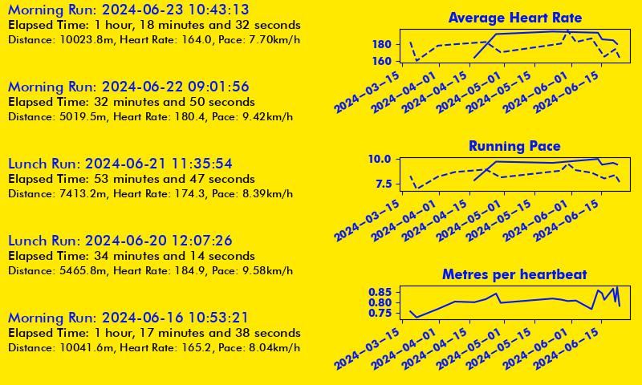

# strava-visualizer

Retrieve activity data from Strava and visualize it to an image!



## Installation

```shell
python3 -m pip install -e '[.dev]'
```

## Authentication to Strava API

1. A `credentials.toml` file that contains your Strava API client ID/secret as well as authorization code if running for the first time:

```toml
[strava]
client_id = "{YOUR_CLIENT_ID}"
client_secret = "{YOUR_CLIENT_SECRET}"
code = "{YOUR_AUTH_CODE}"
```

2. A `tokens.json` file with the following:

```json
{
    "access_token": "{YOUR_ACCESS_TOKEN}",
    "expires_at": "EXPIRES_AT",
    "expires_in": "EXPIRES_IN",
    "refresh_token": "{YOUR_REFRESH_TOKEN}",
    "token_type": "Bearer"
}
```

The script will use the tokens in `tokens.json` to auth or re-authenticate itself if the access token has expired.

You can look at Strava's own [documentation](https://developers.strava.com/docs/getting-started/) to find out how to get a client id/secret.
## Shell Args

```shell
❯ python3 main.py -h
usage: strava-visualizer [-h] [-c CREDS] [-t {Walk,Run,All}] [-m {0,1}] [-o OUTPUT] [-iw WIDTH] [-ih HEIGHT] [-f {json,image}] [-ma MAX_ACTIVITIES] [-p PRIMARY_COLOR]
                         [-s SECONDARY_COLOR]

Get last activities from strava and make a cool image!

options:
  -h, --help            show this help message and exit
  -c CREDS, --creds CREDS
  -t {Walk,Run,All}, --type {Walk,Run,All}
                        type of activity to filter for
  -m {0,1}, --map {0,1}
                        include map key in output JSON
  -o OUTPUT, --output OUTPUT
                        handle to output file to write JSON or image to
  -iw WIDTH, --width WIDTH
                        If writing image, the width of the image being written
  -ih HEIGHT, --height HEIGHT
                        If writing image, the width of the image being written
  -f {json,image}, --file_type {json,image}
  -ma MAX_ACTIVITIES, --max_activities MAX_ACTIVITIES
  -p PRIMARY_COLOR, --primary-color PRIMARY_COLOR
  -s SECONDARY_COLOR, --secondary-color SECONDARY_COLOR
```